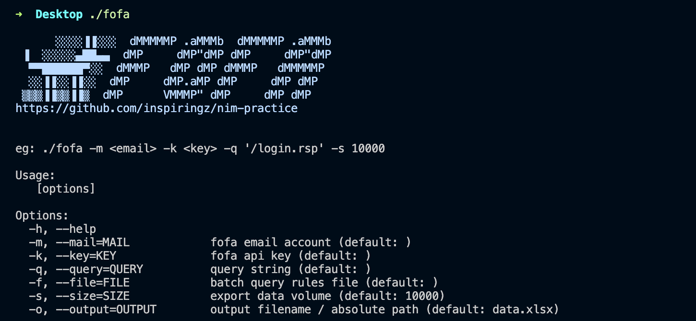

# fofa 

[](https://nim-lang.org/)

Yet another fofa CLI tool, which batch export query data to xlsx.

## Snapshot


## Usage



```bash
./fofa -h
./fofa -m <email> -k <key> -q <query> -s <size> -o <output> 
./fofa -m <email> -k <key> -f <rules> -s <size> -o <output> 
```

## Compile

Full platform support(Windows, Linux, OSX, etc), need nim, nimble and [nimlibxlsxwriter](https://github.com/KeepCoolWithCoolidge/nimlibxlsxwriter) & [libxlsxwriter](https://github.com/jmcnamara/libxlsxwriter) support. OS X Example：

```bash
# xlsx write support
nimble install nimgen
nimble install nimlibxlsxwriter
brew install libxlsxwriter
# another support
nimble install argparse
# complie
nim c -d:ssl -d:release fofa.nim 
```

You can also find the compiled version under `./bin/` directory.

